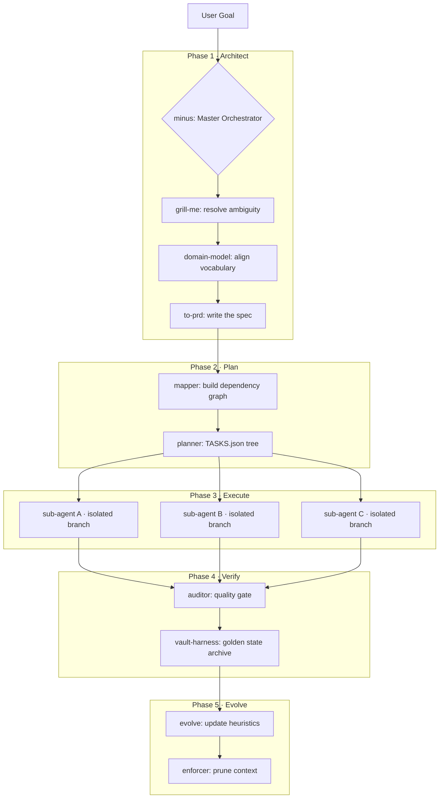

# minusWorkflows

**High-precision AI engineering. Software development minus the overhead.**

A surgical, phase-based skill stack for Gemini CLI that replaces ad-hoc prompting with a structured, self-improving engineering methodology. Parallel sub-agents. Structural codebase mapping. Reinforcement learning. Zero context bloat.

---

## The Problem

Standard AI agents fail at scale in three ways:

| Failure | Cause | Effect |
| :--- | :--- | :--- |
| **Context Dumb Zone** | Irrelevant files flood the window | Reasoning quality collapses past 60% capacity |
| **Integration Hell** | Parallel agents share a repo blindly | Conflicting edits, broken builds |
| **Conceptual Drift** | No project-level memory | AI repeats the same architectural mistakes |

minusWorkflows solves all three with a **Surgical Context model** and a **Linear Evolutionary framework**.

---

## How It Works

One command invokes the full lifecycle:

```
Gemini, minus: [your goal]
```

The **Master Orchestrator** (`minus`) runs five phases:

```
Architect → Planner → Swarm Execution → Audit → Evolve
```



---

## The Skill Stack

### Core Pipeline

| Skill | Command | Role |
| :--- | :--- | :--- |
| `minus` | `Gemini, minus: [goal]` | Master Orchestrator. Runs the full lifecycle. |
| `architect` | `architect` | Ideation → PRD. Runs grill-me + domain-model + to-prd + auditor. |
| `builder` | `builder` | PRD → Code. Runs planner + to-issues + tdd + auditor. |
| `maintainer` | `maintainer` | Fix & Improve. Runs triage + diagnose + auditor + improve. |
| `agentic` | `agentic` | Teach Gemini a new skill. |

### Research & Planning

| Skill | Role |
| :--- | :--- |
| `mapper` | Builds a SQLite dependency graph via `uvx code-review-graph`. Blast-radius analysis before any change. |
| `planner` | Converts a PRD into a dependency-aware `TASKS.json` tree for parallel execution. |
| `architect` | Combines grill-me → domain-model → to-prd → auditor into one phase. |
| `grill-me` | One-question-at-a-time design interview. Exhausts unknowns before code is written. |
| `domain-model` | Validates new plans against the project's `CONTEXT.md` vocabulary and mandates. |
| `to-prd` | Generates a formal spec from grilled decisions. Saved to `.memory/sessions/[session_id]/[query_id]/PRD_[feature].md`. |
| `to-issues` | Slices a PRD into atomic, dependency-mapped implementation tasks. |

### Execution & Safety

| Skill | Role |
| :--- | :--- |
| `tdd` | Red → Green → Refactor loop. Never writes code before a failing test. |
| `diagnose` | Scientific debugging: Reproduce → Trace → Hypothesize → Fix. |
| `auditor` | Quality gate at every phase transition. Blocks drift and security regressions. |
| `vault-harness` | Sandbox isolation for experimental code + golden-state backup to `.vault/`. |

### Intelligence & Routing

| Skill / Utility | Role |
| :--- | :--- |
| `control-pane` | Dynamic model selection and escalation. Maps task metadata to AI model tiers (Flash vs Pro). |
| `scanner.js` | Autodetects available AI models via environment variables, CLI tools, or `.memory/models.json`. |
| `budget_tracker.js` | Enforces session budgets and prompts for confirmation before invoking expensive Ultra-tier models. |

### Context Engineering

| Skill | Role |
| :--- | :--- |
| `enforcer` | Safety guardrails (blocks force-push, rm -rf, etc.) + context window pruning. |
| `minustoken` | Four-tier token density control: L1 (full) → L4 (code-only). |
| `evolve` | Captures Scenario → Failure → Fallback patterns. Updates `.memory/EVOLUTION.md`. |

---

## Architecture Advantages

| Dimension | Standard AI Agent | minusWorkflows |
| :--- | :--- | :--- |
| **Context** | Full-file dumps or RAG | Structural graph + delta snapshots |
| **Reasoning headroom** | Hits the dumb zone | Constant 60%+ buffer via `enforcer` |
| **Execution model** | Single-agent sequential | Parallel swarm, dependency-isolated |
| **Memory** | Session-only | Reinforcement evolution via `.memory/` |
| **Safety** | Direct source edits | Sandbox harness → audit → merge |

---

## Project Layout After Installation

```
your-project/
├── .memory/
│   ├── CONTEXT.md          # Domain language and mandates
│   ├── EVOLUTION.md        # Scenario → Failure → Fallback log
│   └── sessions/           
│       └── [session_id]/
│           └── [query_id]/
│               ├── ROADMAP.md          # Human-readable task graph
│               ├── TASKS.json          # Machine-readable dependency tree
│               └── snapshots/          # Versioned structural deltas
├── .vault/
│   ├── backups/            # Verified golden states
│   ├── sandbox/            # Isolated experiment space
│   └── INDEX.md            # Wikilink map of snapshots and ADRs
└── .code-review-graph/
    └── graph.db            # SQLite dependency graph
```

---

## Installation

```bash
# Clone the stack
git clone https://github.com/YOUR_USERNAME/minusWorkflows.git

# Inject into any project
node /path/to/minusWorkflows/install.js
```

**Prerequisites**: Gemini CLI, `uv` (for `uvx code-review-graph`).

---

## Quick Reference

```
Gemini, minus: [complex feature]        # Full lifecycle
Gemini, architect: [idea]              # Design only
Gemini, builder: [PRD reference]       # Implement only
Gemini, maintainer: [bug or issue]     # Fix & improve
/mt L4                                 # Switch to code-only mode
/mt L1                                 # Switch to full-fidelity mode
```

See [QUICKSTART.md](QUICKSTART.md) for a step-by-step first run.

---

Built for AI-native engineers who ship.
