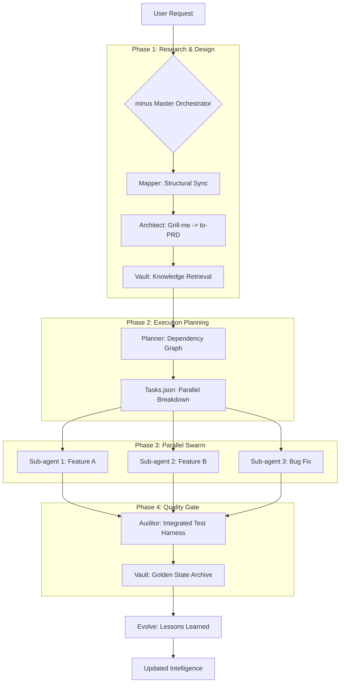

# minusWorkflows

**High-precision orchestration for Gemini CLI. Software engineering minus the overhead.**

`minusWorkflows` is a surgical, phase-based pipeline designed to replace generic AI "chatting" with modular, data-driven engineering workflows. It utilizes structural codebase mapping, parallel sub-agent execution, and reinforcement learning to deliver features with maximum rigor and minimum token bloat.

---

## Architecture Overview



---

## Core Capabilities

### 1. Structural Mapping (The Spine)
Powered by `code-review-graph`, the system maintains a local SQLite map of your entire project. The AI uses this to identify the "Blast Radius" of changes, allowing it to read only the relevant files and reduce token usage by 5x-10x.

### 2. The Minustoken Protocol (Density Control)
Automatically manage the AI's verbosity based on the task:
- **L1 (Full Fidelity)**: High-precision architectural design and auditing.
- **L2 (Telegraphic)**: Default developer mode (fast & efficient).
- **L4 (Code-Only)**: Zero-prose implementation for maximum logic budget.

### 3. Parallel Swarm Orchestration
The **`minus`** master agent identifies independent tasks and spawns parallel sub-agents on isolated git branches. It manages conflict resolution and integrates them only after passing a unified test harness.

### 4. Self-Evolving Intelligence
Every session ends with the **`evolve`** phase. The AI analyzes its failures and successes, updating a local `EVOLUTION.md` heuristics tree. It learns from its own mistakes so it never makes the same error twice on your project.

### 5. Vault-Harness (Safety & Archival)
- **Harness**: Isolated sandboxes for high-risk development.
- **Vault**: Immutable local backups of verified "Golden States" for future-proofing and recovery.

---

## Installation

Inject the "Minus-stack" into any project root:

```bash
# Clone the repository
git clone https://github.com/YOUR_USERNAME/minusWorkflows.git

# Inject into your project
node C:/path/to/minusWorkflows/install.js
```

---

## Usage

Start the orchestrator with a single command:

> "Gemini, minus: [Your Feature/Fix Request]"

The system will take it from there - mapping, design, implementation, and evolution.

---
Built for the next generation of AI-Native Engineers.
